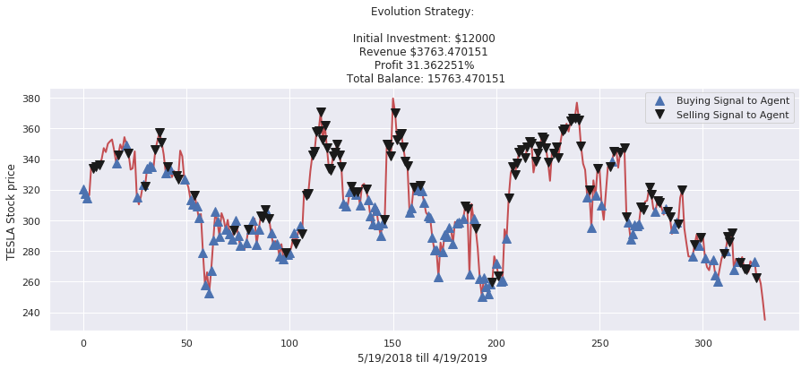
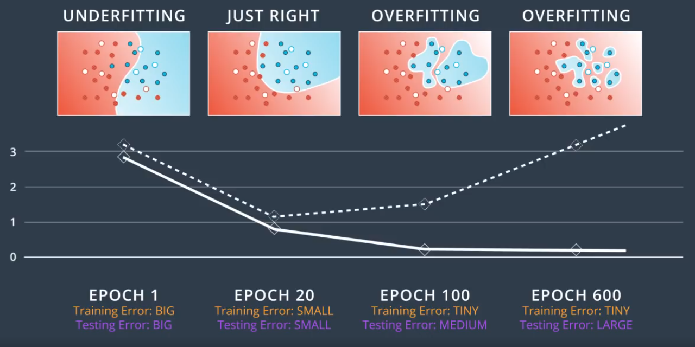
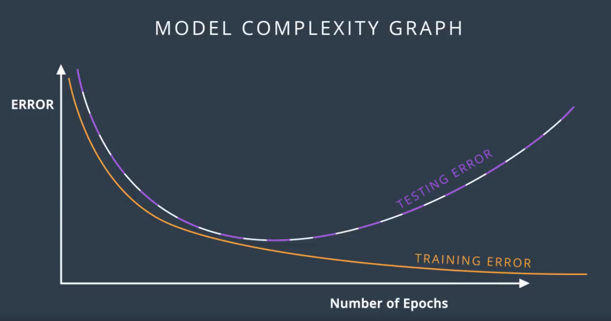
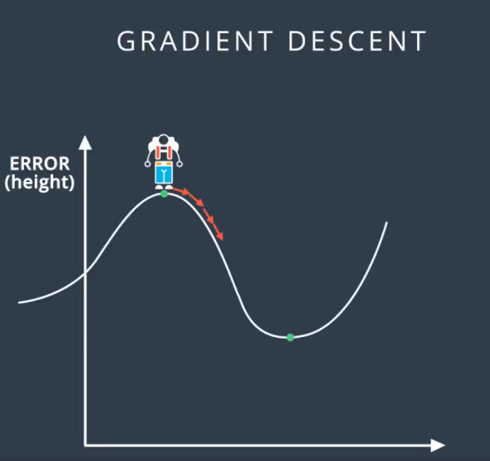
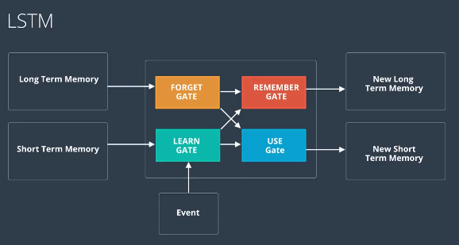
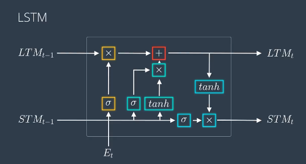

# Machine Learning for Financial
data processing, trading signal generation, portfolio management using L
Deep Reinforcement Learning for trading strategies and more.

Sources: Udacity NanoDegree Program=(https://www.udacity.com/course/ai-for-trading--nd880)

## Introduction

Recurrent Neural Networks
Three input and output for each neuron: Short-Term, Long-Term, Event

1.simpleRRN=()

#Project   
Deep Evolution Strategy   

#Part II

## Word Embeddings:	

Current time is 22:00:44
Today is Sunday, 6/30/2019	

Models that are set to learn patterns, vocabs.

\@Linear Algebra:

\@Training:

**Dropout:** Buffed in all areas of body rather than one hand.

Weights get **buffed**. Randomly we turn off the notes so other nodes take up
the process.

Dropout = at each epoch 0.2 each node gets off and on average will make sure all
the nodes are

Vanishing gradient:

Problem Tiny changes on weights. Never able to find minimum.

Solution: ReLU,

  
**\@LSTM**

**Why like this only it works:**  
**Try to come up with a better architecture**
